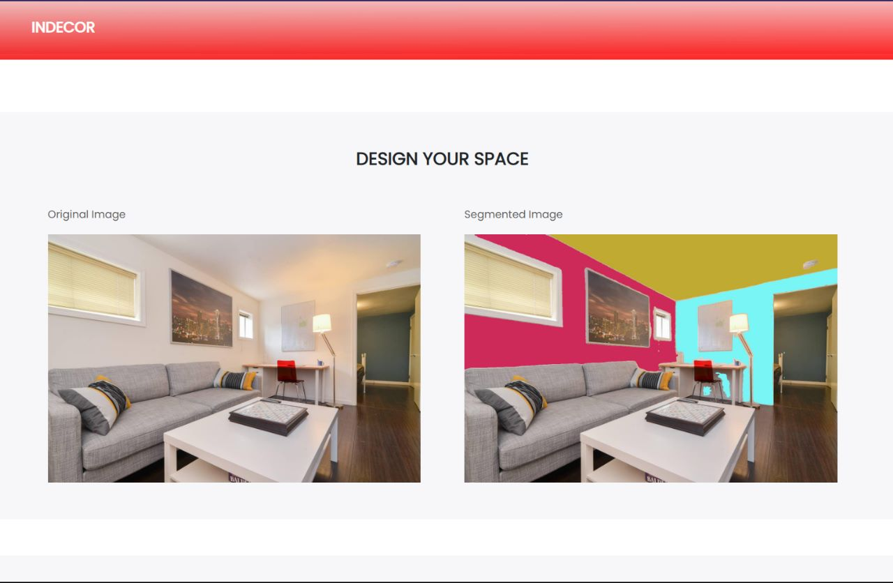
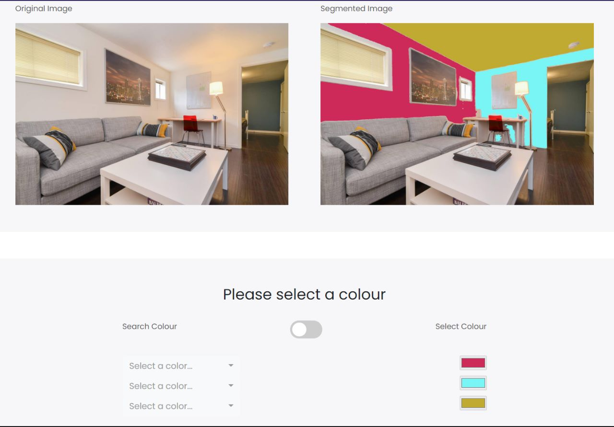
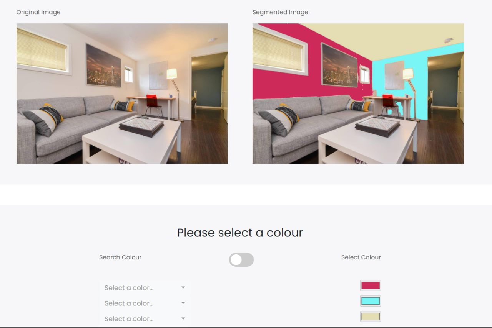
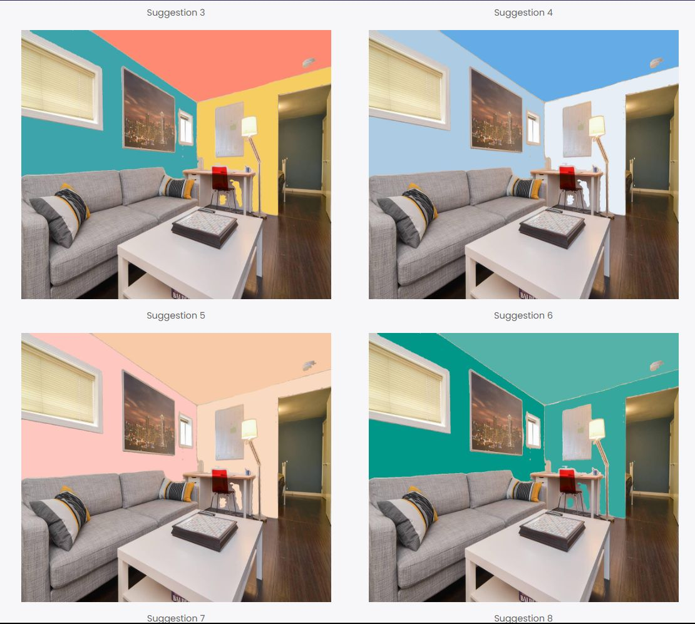
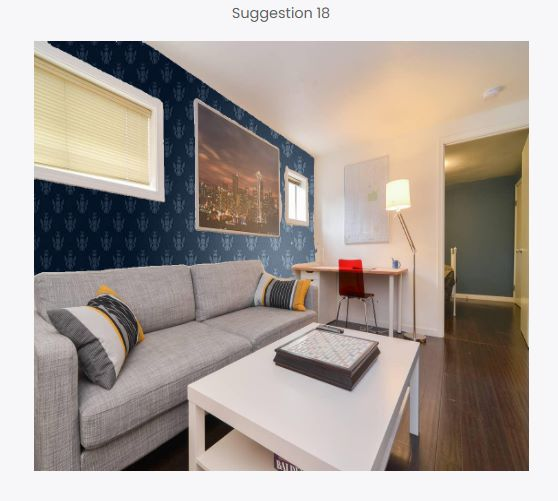
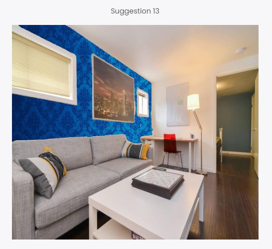

<h1 align="center">Indecor 🏠</h1>
<div align="center">
  <h3> Where technology meets design </h3>
</div>

## Overview

The initial task on homeowners’ lists when renovating or redecorating their homes is to paint the walls. This simple project provides an easy way to give a room a fresh look and can even set the tone for the entire house. However, choosing the right paint colour can be overwhelming due to the endless options available, and a poor decision can be costly

To alleviate this problem, we come up with a robust system **Indecor** that enables homeowners to visualize how their homes would appear with a new coat of paint.This system is intelligent enough to ignore the complex objects within the house and accurately paint only the necessary wall sections, while still maintaining a realistic representation of the image.


### Get your walls painted!


### Select color


### Changed color


### Color recommendations


### Texture recommendations




### To run this project :

Clone the project -
```
  $ git clone https://github.com/rushabhgandhi13/djcsi_team_eternium.git
```
  
- ### Start the server -
```
  $ cd Indecor
 ``` 
Install all the reqirements -
```
  $ pip install -r requirements.txt
 ``` 
Run the following commands -

 for linux/mac :
``` 
  $ python3 manage.py migrate
  $ python3 manage.py makemigrations
``` 
 for windows :
 ``` 
  $ python manage.py migrate
  $ python manage.py makemigrations
 ``` 
Start the project -

 for linux/mac :
```
  $ python3 manage.py runserver
```  
 for windows :
``` 
  $ python manage.py runserver
```

---
<h3 align="center"><b>Developed with :heart: by <a href="https://github.com/rushabhgandhi13">Rushabh Gandhi</a>, <a href="https://github.com/pathikg">Pathik Ghugare</a>, <a href="https://github.com/nixen2802">Nayan Mandliya</a>, <a href="https://github.com/hussein-hub">Hussein Motiwala</a>.</b></h1>
